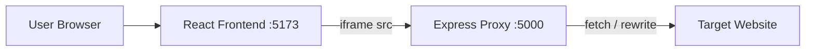

# Web Portal — Reverse Proxy Embedder

Full-stack application that loads an external website (target site) inside your host site by proxying all traffic through a Node.js backend. The React frontend provides a browser-like shell with navigation controls.

```
project/
├── frontend/     React + Vite + Tailwind
├── backend/      Express + http-proxy-middleware
└── README.md
```

## Quick start

### 1. Install dependencies

```bash
npm run install:all
```

### 2. Configure environment

```bash
cp backend/.env.example backend/.env
cp frontend/.env.example frontend/.env
```

Edit `frontend/.env`:

```env
VITE_API_URL=http://localhost:5000
VITE_DEFAULT_TARGET_URL=https://reverse-proxy-p1ne.onrender.com/
```

### 3. Run backend (terminal 1)

```bash
cd backend && npm run dev
```

Backend: **http://localhost:5000**

### 4. Run frontend (terminal 2)

```bash
cd frontend && npm run dev
```

Frontend: **http://localhost:5173**

### 5. Use the app

Open **http://localhost:5173** — it loads [Quantum Registry](https://reverse-proxy-p1ne.onrender.com/) by default. Change the URL in the bar to browse another site.

Proxy endpoint format:

```
http://localhost:5000/proxy?url=https://example.com
```

---

## Architecture



| Layer | Role |
|--------|------|
| **Frontend** | UI shell, URL bar, history, iframe pointing at `/proxy?url=...` |
| **Backend** | Reverse proxy, strips frame-blocking headers, rewrites HTML/CSS/JS URLs |
| **Target site** | Served as if same-origin through the proxy |

---

## Features

### Backend

- Reverse proxy via `http-proxy-middleware`
- Strips `X-Frame-Options`, `Content-Security-Policy` frame restrictions
- Rewrites HTML/CSS/JS asset URLs through `/proxy?url=`
- CORS for the React dev server
- Cookie forwarding (`Cookie` header on upstream requests)
- WebSocket support (`ws: true`)
- Optional host whitelist (`ALLOWED_HOSTS`)
- Health check: `GET /health`

### Frontend

- Responsive navbar (back, forward, reload, URL input)
- Fullscreen iframe layout
- Loading spinner and timeout error screen
- `postMessage` bridge for in-page link navigation
- Backend health check on startup

---

## Environment variables

### Backend (`backend/.env`)

| Variable | Default | Description |
|----------|---------|-------------|
| `PORT` | `5000` | Server port |
| `CORS_ORIGINS` | `http://localhost:5173` | Allowed frontend origins |
| `PROXY_PUBLIC_URL` | `http://localhost:5000` | Base URL used in rewritten links |
| `ALLOWED_HOSTS` | *(empty = all)* | Comma-separated host whitelist |
| `PROXY_TIMEOUT_MS` | `30000` | Upstream timeout |
| `MAX_REWRITE_BYTES` | `5242880` | Max body size for content rewriting |

### Frontend (`frontend/.env`)

| Variable | Default | Description |
|----------|---------|-------------|
| `VITE_API_URL` | `http://localhost:5000` | Backend base URL |
| `VITE_DEFAULT_TARGET_URL` | `https://example.com` | Initial loaded site |

---

## Production build

```bash
# Build frontend
cd frontend && npm run build

# Serve static files (nginx/caddy) and run backend
cd backend && NODE_ENV=production npm start
```

Set `PROXY_PUBLIC_URL` to your public API domain and restrict `ALLOWED_HOSTS`.

---

## UI preview

The interface includes:

- Dark theme browser chrome
- Lock icon + URL bar + **Go** button
- Back / Forward / Reload controls
- Full-viewport proxied site below the navbar
- Centered spinner while loading
- Error panel with **Try again** on failure

---

## iframe limitations

| Limitation | Impact |
|------------|--------|
| **Cross-origin parent ↔ iframe** | Parent (port 5173) cannot read iframe DOM when iframe points directly at a third-party domain. |
| **X-Frame-Options / CSP** | Many sites set `DENY` or `frame-ancestors` — raw iframe embed fails. |
| **Cookies (third-party)** | Browsers increasingly block third-party cookies in iframes. |
| **Fullscreen / permissions** | Camera, mic, geolocation may be blocked in sandboxed iframes. |
| **OAuth / SSO** | Login flows often break when embedded. |

**This project** loads the iframe from your **proxy** (`localhost:5000/proxy?...`), not the raw target domain — so frame headers are stripped and the iframe origin becomes your proxy host.

---

## CORS issues

Browsers enforce the **Same-Origin Policy**. If the frontend called `https://secondsite.com/api` directly, the browser would block responses unless the target sends `Access-Control-Allow-Origin`.

The reverse proxy:

1. Receives requests from the browser to **your** backend (same configured CORS origin).
2. Fetches the target server-side (no browser CORS).
3. Returns data to the frontend.

---

## Why some websites block embedding

Sites block embedding to prevent:

- **Clickjacking** — tricking users into clicking hidden UI
- **Brand / UX control** — forcing users onto their domain
- **Data leakage** — parent page reading embedded content
- **Compliance** — PCI, HIPAA, session isolation

Common defenses:

- `X-Frame-Options: DENY | SAMEORIGIN`
- `Content-Security-Policy: frame-ancestors 'none'`
- JavaScript frame-busting (`if (top !== self) top.location = self.location`)
- Bot / WAF rules blocking non-browser user agents

---

## How a reverse proxy solves it

1. **Server-side fetch** — Your backend requests the target; browser never talks to the target origin directly for page HTML.
2. **Header stripping** — Remove frame-blocking headers before the response reaches the iframe.
3. **URL rewriting** — Change `href` / `src` / `url()` so assets and links go through `/proxy?url=...`.
4. **Injected bridge script** — Notifies the parent app on navigation via `postMessage`.
5. **WebSockets** — `ws: true` tunnels WS through the proxy where supported.

**Caveats:** Heavy SPAs, signed URLs, strict CSP inside inline scripts, CAPTCHAs, and anti-bot systems may still fail.

---

## Security considerations

> **Only proxy sites you own or have permission to embed.** Open proxies are a common abuse vector.

| Risk | Mitigation |
|------|------------|
| **SSRF** | Use `ALLOWED_HOSTS`; block internal IPs in production |
| **Open proxy abuse** | Authentication, rate limits, logging |
| **Credential theft** | Never proxy untrusted login pages for users |
| **Malicious HTML/JS** | Proxied scripts run in the user’s browser — treat as executing untrusted code |
| **Legal** | Respect terms of service and copyright |

Recommended production controls:

- Host whitelist (`ALLOWED_HOSTS`)
- User authentication on the portal
- Rate limiting (e.g. `express-rate-limit`)
- HTTPS everywhere
- Disable proxy in production unless explicitly needed

---

## Tech stack

| Part | Stack |
|------|--------|
| Frontend | React 18, Vite 5, Tailwind CSS 3, Axios |
| Backend | Node.js 18+, Express 4, http-proxy-middleware 3, Cheerio |

---

## API routes

| Method | Path | Description |
|--------|------|-------------|
| `GET` | `/health` | Service status |
| `GET/POST/...` | `/proxy?url=<encoded>` | Proxied resource |

---

## Troubleshooting

| Problem | Fix |
|---------|-----|
| Backend unavailable | Run `cd backend && npm run dev` |
| Blank iframe | Check browser console; try `https://example.com` first |
| Broken CSS/JS | Target may use absolute URLs to another CDN; check rewrite logs |
| Login fails | Expected for many OAuth flows inside proxies |
| 403 Host not allowed | Add hostname to `ALLOWED_HOSTS` or clear it for dev |

---

## License

MIT — use responsibly.
